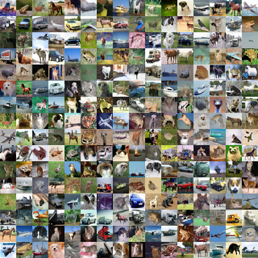
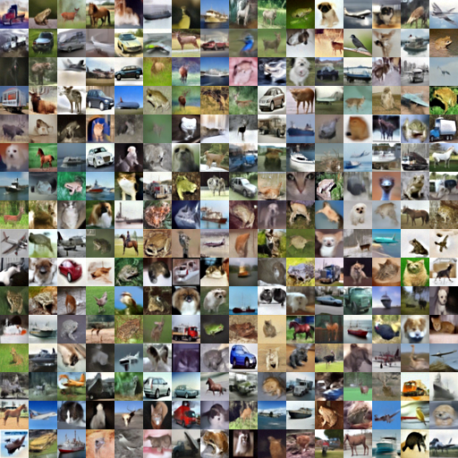

# Unified Sampling Framework (USF)

This is the repository of the paper "A Unified Sampling Framework for Solver Searching of Diffusion Probabilistic Models". We provide some example solver schedules to reproduce our results in the paper.

## Dataset, Checkpoint and FID Stats
Please check the config files in `configs/`.

Please put the download model to `checkpoints/`. For model loading, please check this code for details: `functions/ckpt_util.py`. If you want to use other FID Stats to further verify our results, please put it in the `fid_stats/cifar10` and run our code in `evaluate/fid_score.py`. You can change the fid_stats' location in `configs/cifar10_continuous.yml`. `main.py` support compute fid automatically if set '--fid'.


| Config File            | Checkpoint                                                   | Other FID Stats                                              |
| ---------------------- | ------------------------------------------------------------ | ------------------------------------------------------------ |
| edm-cifar10-32x32-uncond-vp.yml            | Download [EDM checkpoint on CIFAR-10](https://nvlabs-fi-cdn.nvidia.com/edm/pretrained/edm-cifar10-32x32-uncond-vp.pkl) in `checkpoints/`. | [Download](https://drive.google.com/drive/folders/1_OpTXVPLffZM8BG-V3Ahsxk99aqxW7C3?usp=sharing) `fid_stats_cifar10_train_pytorch.npz` |

## DPM-Solver-v3's EMS **(Requied)**
Download the folder `edm-cifar10-32x32-uncond-vp` from https://drive.google.com/drive/folders/1sWq-htX9c3Xdajmo1BG-QvkbaeVtJqaq and put it under the folder `dpm_solver_v3/`.

## Command
We provide a command for sampling and FID evaluation here.
```bash
python main.py --config configs/edm-cifar10-32x32-uncond-vp.yml --sample_type unisampler --gpu 4 --exp exps/nfe3 --sample --fid --load_decision solver_schedules/cifar10_edm_nfe3.pth --statistics_dir dpm_solver_v3/edm-cifar10-32x32-uncond-vp/0.002_80.0_1200_1024 --dpmsolver_v3_t_start 80 --dpmsolver_v3_t_end 0.002 --number_of_samples 50000
```

We also implemented DPM-Solver++, UniPC, DPM-Solver-v3 in this code base. The command are as follows:
```bash
python main.py --config configs/edm-cifar10-32x32-uncond-vp.yml --gpu 4 --exp exps/dpmsolver++ --sample --fid  --statistics_dir dpm_solver_v3/edm-cifar10-32x32-uncond-vp/0.002_80.0_1200_1024 --number_of_samples 50000 --sample_type dpmsolver++ --timesteps 5

python main.py --config configs/edm-cifar10-32x32-uncond-vp.yml --gpu 4 --exp exps/unipc --sample --fid  --statistics_dir dpm_solver_v3/cifar10_ddpmpp_deep_continuous/0.0001_1200_4096 --number_of_samples 50000 --sample_type unipc --timesteps 5

python main.py --config configs/edm-cifar10-32x32-uncond-vp.yml --gpu 4 --exp exps/dpmsolver_v3 --sample --fid  --statistics_dir dpm_solver_v3/edm-cifar10-32x32-uncond-vp/0.002_80.0_1200_1024 --number_of_samples 50000 --sample_type dpmsolver_v3 --timesteps 5  --dpmsolver_v3_t_start 80 --dpmsolver_v3_t_end 0.002
```
Details about how to use these implement can be found in `main.py`'s args. **Notice**: The FID of baseline methods we report below are searched best settings (under their framework), so directly use the default settings might get worse FID performance. 

## FID results
| **Method**        | **NFE: 3** | **NFE: 4** | **NFE: 5** | **NFE: 6** | **NFE: 7** | **NFE: 8** | **NFE: 9** | **NFE: 10** |
|--------------------|------------|------------|------------|------------|------------|------------|------------|-------------|
| DPM-Solver++       | 110.71     | 46.47      | 25.14      | 12.31      | 6.96       | 4.61       | 3.51       | 3.08        |
| UniPC              | 110.3      | 44.38      | 24.15      | 11.52      | 6.03       | 4.05       | 3.31       | 2.98        |
| DPM-Solver-v3      | 85.18      | 27.18      | 12.45      | 8.76       | 5.60       | 3.66       | 2.84       | 2.62        |
| **Ours**           | **10.42**  | **6.43**   | **3.93**   | **2.48**   | **2.42**   | **2.43**   | **2.33**   | **2.20**    |

## Samples generated by searched solver-schedules
<div style="display: flex; justify-content: space-around;">

  <div style="text-align: center;">
    
    <p>Samples generated by USF NFE=5</p>
  </div>

  <div style="text-align: center;">
    
    <p>Samples generated by DPM-Solver-v3 NFE=5</p>
  </div>

</div>