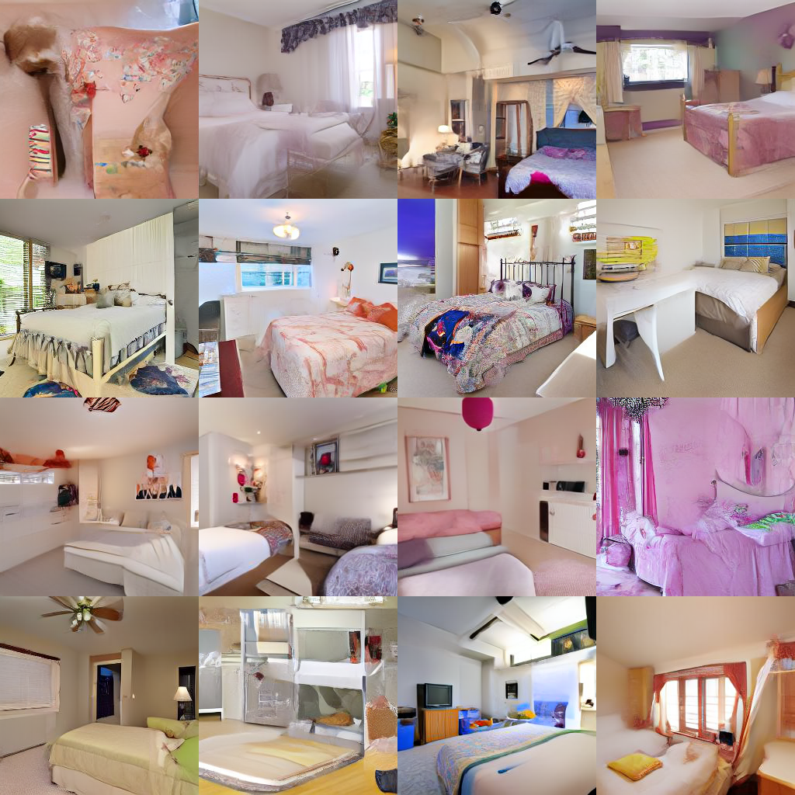
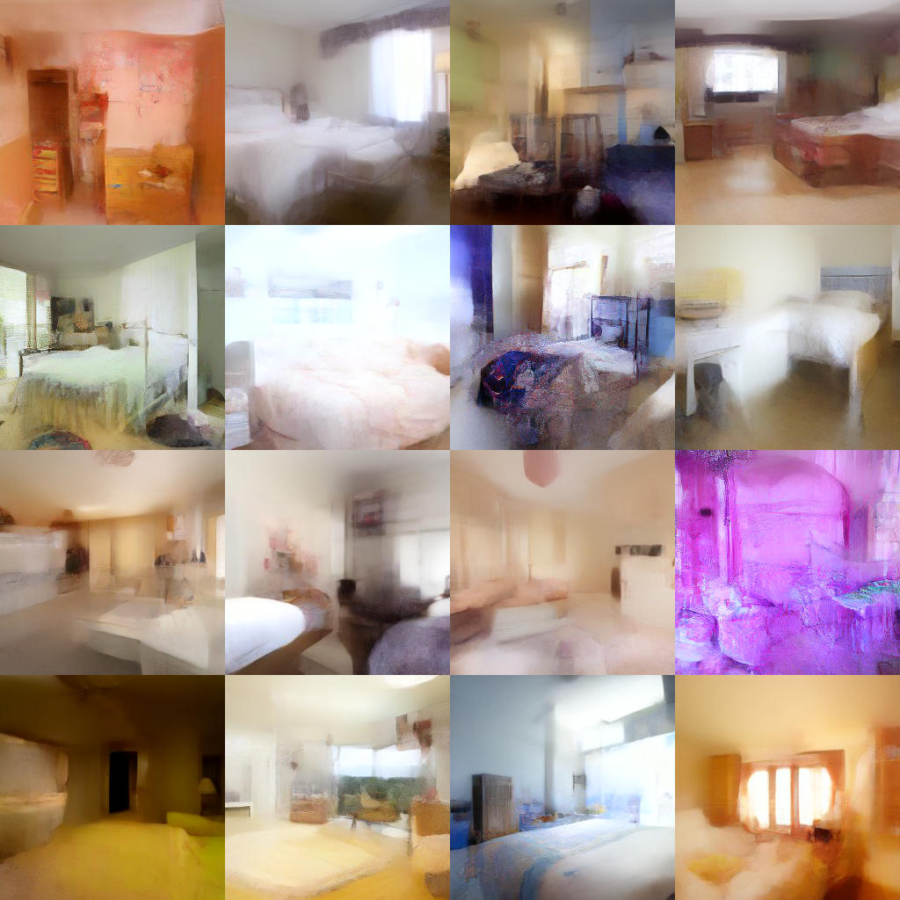

# Unified Sampling Framework (USF)
This repository contains code for USF. It is built upon the implementation of DPM-Solver-v3. 

## Preparation

Install the packages

```shell
pip install opencv-python omegaconf tqdm einops pytorch-lightning==1.6.5 transformers kornia
pip install torch torchvision
pip install -e ./src/clip/
pip install -e ./src/taming-transformers/
```


For Latent-Diffusion on LSUN-Bedroom:

- Download the pretrained models

  ```shell
  mkdir -p checkpoints/first_stage_models/vq-f4
  wget -O checkpoints/first_stage_models/vq-f4/model.zip https://ommer-lab.com/files/latent-diffusion/vq-f4.zip
  cd checkpoints/first_stage_models/vq-f4
  unzip -o model.zip
  cd ../../..
  
  mkdir -p checkpoints/ldm/lsun_beds256
  wget -O checkpoints/ldm/lsun_beds256/lsun_beds-256.zip https://ommer-lab.com/files/latent-diffusion/lsun_bedrooms.zip
  cd checkpoints/ldm/lsun_beds256
  unzip -o lsun_beds-256.zip
  cd ../../..
  ```

- Download the folder `lsun_beds256` from https://drive.google.com/drive/folders/1sWq-htX9c3Xdajmo1BG-QvkbaeVtJqaq and put it under the folder `statistics/`.

For Stable-Diffusion-v1.4:

- Download https://huggingface.co/CompVis/stable-diffusion-v-1-4-original/resolve/main/sd-v1-4.ckpt from [CompVis/stable-diffusion-v-1-4-original · Hugging Face](https://huggingface.co/CompVis/stable-diffusion-v-1-4-original) and put it under the folder `models/ldm/stable-diffusion-v1/`.

- Download the folder `sd-v1-4` from https://drive.google.com/drive/folders/1sWq-htX9c3Xdajmo1BG-QvkbaeVtJqaq and put it under the folder `statistics/`.


## Generate Samples
The Searched solver schedules are in `solver_schedules/`. Currently we only support FID computation for LSUN-Bedroom. Please [download](https://openaipublic.blob.core.windows.net/diffusion/jul-2021/ref_batches/lsun/bedroom/VIRTUAL_lsun_bedroom256.npz) LSUN Bedroom's FID statistics, and put in in `fid_stats/`. Add `--fid` in the command and it will compute FID after generation.
### LSUN Bedroom
```bash
python sample.py --config configs/latent-diffusion/lsun_bedrooms-ldm-vq-4.yaml --ckpt checkpoints/ldm/lsun_beds256/model.ckpt --gpu 0 --method unisampler --load_decision solver_schedules/lsun/lsun_nfe3.pth --n_samples 16 --exp exp/lsun --H 256 --W 256 --C 3 --f 4 --statistics_dir statistics/lsun_beds256/120_1024
```

### Stable Diffusion
```bash
python sample.py --config configs/stable-diffusion/v1-inference.yaml --ckpt checkpoints/ldm/stable-diffusion-v1/sd-v1-4.ckpt --gpu 0 --method unisampler --load_decision solver_schedules/stable_diffusion/stable_diffusion_nfe5.pth --exp exp/stable_diffusion --H 512 --W 512 --C 4 --f 8 --statistics_dir statistics/sd-v1-4/7.5_250_1024 --prompt A\ beautiful\ castle\ beside\ a\ waterfall\ in\ the\ woods,\ by\ Josef\ Thoma,\ matte\ painting,\ trending\ on\ artstation\ HQ --n_samples 25
```

## Sample Quality
### LSUN Bedroom
<div style="display: flex; justify-content: space-around;">

  <div style="text-align: center;">
    
    <p>Samples generated by USF NFE=3</p>
  </div>

  <div style="text-align: center;">
    
    <p>Samples generated by DPM-Solver-v3 NFE=3</p>
  </div>

</div>

### Stable Diffusion
<div style="display: flex; justify-content: space-around;">

  <div style="text-align: center;">
    
    <p>Samples generated by USF NFE=5</p>
  </div>

  <div style="text-align: center;">
    
    <p>Samples generated by DPM-Solver-v3 NFE=5</p>
  </div>

</div>

## FID results

### LSUN Bedroom
| **Method**       | **3**   | **4**   | **5**   | **6**   | **7**   | **8**   | **9**   | **10**  |
|-------------------|---------|---------|---------|---------|---------|---------|---------|---------|
| DPM-Solver       | 118.21  | 50.49   | 21.78   | 10.98   | 7.03    | 5.54    | 4.93    | 4.70    |
| DPM-Solver++     | 118.45  | 50.57   | 19.71   | 9.34    | 6.11    | 5.13    | 4.84    | 4.75    |
| UniPC            | 103.23  | 34.62   | 12.36   | 7.51    | 5.81    | 5.20    | 4.86    | 4.73    |
| DPM-Solver-v3    | 81.33   | 29.68   | 12.02   | 6.99    | 5.24    | 4.83    | 4.66    | 4.50    |
| Ours             | **8.62**| **6.65**| **6.04**| **4.81**| **4.49**| **4.12**| **4.13**| **4.14**|

### Stable Diffusion
| **Method**       | **3**    | **4**    | **5**    | **6**    | **7**    | **8**    | **9**    | **10**   |
|-------------------|----------|----------|----------|----------|----------|----------|----------|----------|
| DPM-Solver       | 43.86    | 26.9     | 21.78    | 19.75    | 18.77    | 18.17    | 17.87    | 17.57    |
| DPM-Solver++     | 43.58    | 27.02    | 22.18    | 19.82    | 18.73    | 18.13    | 17.76    | 17.47    |
| UniPC            | 45.62    | 28.3     | 22.44    | 20.05    | 19.04    | 18.52    | 18.00    | 17.74    |
| DPM-Solver-v3    | 59.68    | 31.57    | 22.67    | 19.42    | 18.05    | 17.52    | 17.15    | 16.81    |
| Ours             | **35.06**| **19.51**| **17.66**| **15.32**| **15.38**| **15.22**| **15.47**| **14.95**|
